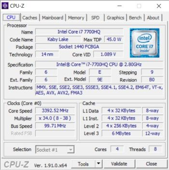
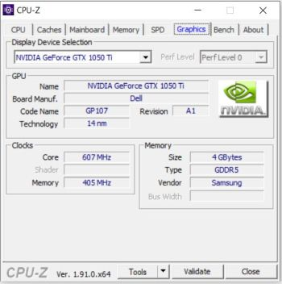
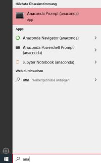
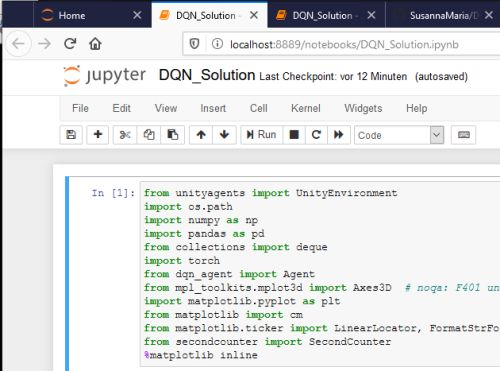

# Udacity-DRL-Bananas-Project

[//]: # (Image References)

[image1]: https://user-images.githubusercontent.com/10624937/42135619-d90f2f28-7d12-11e8-8823-82b970a54d7e.gif "Trained Agent"

# Project 1: Navigation

### Introduction

For this project I used a normal Deep Q-Learning (DQN) algorithm with replay buffer to train an agent to navigate 
through a field of yellow and pruple bananas.  The goal is to collect the yellow bananas and avoid the purple bananas.
The environment is a small square world.  


A reward of +1 is provided for collecting a yellow banana, and a reward of -1 is provided for collecting a blue banana. Thus, the goal of your agent is to collect as many yellow bananas as possible while avoiding blue bananas.

The state space has 37 dimensions and contains the agent's velocity, along with ray-based perception of objects around the agent's forward direction. Given this information, the agent has to learn how to best select actions. Four discrete actions are available, corresponding to:

- **`0`** - move forward.
- **`1`** - move backward.
- **`2`** - turn left.
- **`3`** - turn right.

The task is episodic, and in order to solve the environment, the agent must get an average score of +13 over 100 consecutive episodes.

# Getting Started
## My development environment 
I'm using Windows10/64 on Dell Inspiron P65F Notebook with NVIDIA GPU. The development of the solution took place under Visual Studio Code and the Anaconda Shell. The solution was then transferred to the jupyter notebook "DQN_Solution.ipynb".

| CPU             | GPU |
:-------------------------:|:-------------------------:
  |  

## Install Environment
1. Anaconda

https://repo.anaconda.com/archive/Anaconda3-2020.02-Windows-x86_64.exe

2. Environment
Python 3.6 Environment and not newer is necessary because of Unity 0.4 dependencies like Tensorflow
```
    conda create -n unity_mlagent python=3.6
    conda activate unity_mlagent
```
3. Tensorflow 

    Download of wheel because pip install was not working directly
https://files.pythonhosted.org/packages/fd/70/1a74e80292e1189274586ac1d20445a55cb32f39f2ab8f8d3799310fcae3/tensorflow-1.7.1-cp36-cp36m-win_amd64.whl
```
    pip install tensorflow-1.7.1-cp36-cp36m-win_amd64.whl
```
4. Unity ML Agents

    Download Unity ml agents https://codeload.github.com/Unity-Technologies/ml-agents/zip/0.4.0b and unzip
```
    cd ml-agents-0.4.0b\python
    pip install .
```

5. Pytorch

    Pytorch will be used for the DQN Agent
```
    conda install -c pytorch pytorch
```

6. Additional packages
```
    pip install pandas git
```

7. Banana Environment

    Download https://s3-us-west-1.amazonaws.com/udacity-drlnd/P1/Banana/Banana_Windows_x86_64.zip 
    Unzip in project folder so that ```Banana_Windows_x86_64/Banana.exe```can be found


# Instructions
## Perform Train and testing of DQN Agent via jupyter Notebook
1. Start python environment
    
    Call Anaconda prompt via Windows Start menu

 

```
    cd <project folder>
    conda activate unity_mlagent
``` 
2. Clone project
```
    git clone https://github.com/SusannaMaria/DRLND_P1_BananaCollector.git
    cd DRLND_P1_BananaCollector
```
2. Start of jupyter environment
```
    jupyter notebook
```

3. Open DQN_Solution.ipynb and follow the steps
   
 

## Functions
see [DQN_Solution_functions]("html/DQN_Solution_api.html") for a complete list of available function in DQN Solution notebook

## Training
**Example** :Train 200 episodes
```python
train_scores = dqn_train(state_size, action_size,200)
```
## Evaluation, analytics for Deep Q-Learning agent
**Example** Analysis with pretrained network on Checkpoint 100 to 200 with 100 stepsize. Perform 10 runs for each checkpoint and show goal in plot.
```python
    dqn_analytic_of_scores(state_size, action_size, 100, 200, 100, 10, 13, 333)
```
