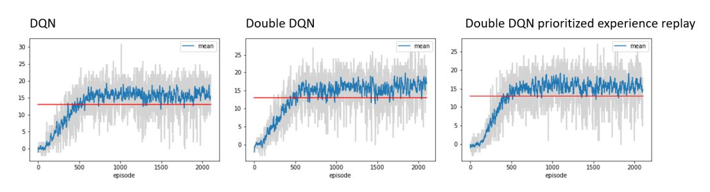
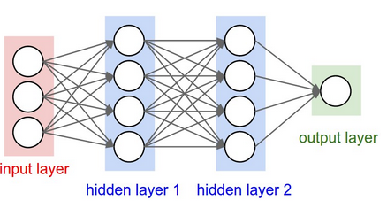
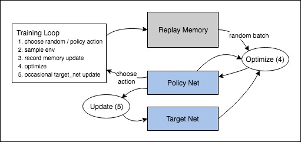

# Introduction

The goal of this project is to train an agent with deep reinforcement learning algorithms to be able to collect as many yellow bananas as possible in a large square world and avoid as many blue bananas as possible.

# Implementation
The focus of the implementation was on a normal DQN algorithm, the training and analytic code. Already during the training of more than 800 episodes with standard DQN, very good results above the required score of 13 were achieved.  

To achieve a better understanding of the further development of the DQN with regard to reducing the overestimation of the Q-values by DDQN and the stronger influence of meaningful experiments by Priotized Experience Replay, I extended the solution with an Agent supporting finally DQN, Double DQN and Double DQN with prioritized experience replay. Code was used from Udacity and https://github.com/ucaiado/banana-rl/blob/master/drlnd/dqn_agent.py. 

During the execution of the model on the banana environment, it came at times to jerking of the agent, so that showed a decrease in the score. The progress of the analysis showed that already after 1000 episodes no significant improvement of the behaviour could be achieved for DQN, DDQN and DDQNPER.

In terms of execution speed and results after training of 2100 episodes, I favor the Double DQN for the Banana Collector.

**DQN:** Episode 2100	Average Score of last 10 episodes: 15.60
Training finished with 2100 episodes in 1048.49 seconds

**DDQN:** Episode 2100	Average Score of last 10 episodes: 17.00
Training finished with 2100 episodes in 1140.06 seconds

**DDQNPER:** Episode 2100	Average Score of last 10 episodes: 14.40
Training finished with 2100 episodes in 2045.02 seconds

# Model
## DQN
We will have one input layer that receives the information of the banana environment state over 37 dimensions and 3 hidden layers. We have 4 nodes in the output layer for possible 4 directions of the agent. So far 64 neurons per hidden layer are used. The loss is MSE and I trained with an ADAM optimizer. As Activation function a ReLu is used. 

# Training

Actions are selected at random or on the basis of a strategy, with the sample for the next stage being taken from the banana area. We store the results in readout memory and also perform an optimization step for each iteration. The optimizer selects a random lot from the playback memory to form the new strategy. The "old" network is used in the optimization to calculate the expected Q-values; it is updated occasionally to keep it up to date.

## Hyperparamters

Only a few combinations were examined, since the agent was able to solve the task after relatively few episodes ~600. Since the task was to exceed an average score of 13 for more than 100 episodes, the occasional jerking of the agent was not significant.

Hyperparameter | Value | Info
--- | --- | ---
BUFFER_SIZE | int(1e5)  | replay buffer size
BATCH_SIZE | 64         | minibatch size
GAMMA | 0.99            | discount factor
TAU | 1e-3              | for soft update of target parameters
LR | 5e-4               | learning rate
UPDATE_EVERY | 4        | how often to update the network
PER_ALPHA | 0.6         | importance sampling exponent
PER_BETA | 0.4          | prioritization exponent

## Ideas for Future Work
I would like to achieve an implementation of the DQN Rainbow algorithm and apply it to visual observation. Surprisingly for me a simple DQN did not seem to have any problems with the environmental state space of the Banana Collector with 37 dimensions and 4 action states, so I might not see the need to work on the extension of the present double DQN.
