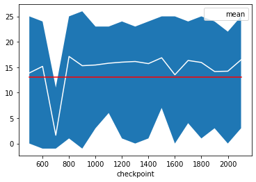

# Introduction

The goal of this project is to train an agent with deep reinforcement learning algorithms to be able to collect as many yellow bananas as possible in a large square world and avoid as many blue bananas as possible.

# Implementation
The focus of the implementation was on a normal DQN algorithm. Already during the training of more than 800 episodes very good results above the required score of 13 were achieved.

During the execution of the model on the banana environment, it came at times to jerking of the agent, so that it came to a decrease in the score. The progress of the analysis showed that already after 1000 episodes no significant improvement of the behaviour could be achieved.

# Model

We will have one input layer that receives the information of the banana environment state over 37 dimensions and 3 hidden layers. We have 4 nodes in the output layer for possible 4 directions of the agent. So far 64 neurons per hidden layer are used. The loss is MSE and I trained with an ADAM optimizer. As Activation function a ReLu is used. 

# Training

## Hyperparamters

After exploring several combinations, values below for hyperparameters allows the agent to solve the problem in the least amount of time required.

Hyperparameter | Value
--- | ---
BUFFER_SIZE | 1e5    
Batch size | 64
Gamma | 0.99
τ | 1e-3
LR | 5e-4
UPDATE_EVERY | 4 
